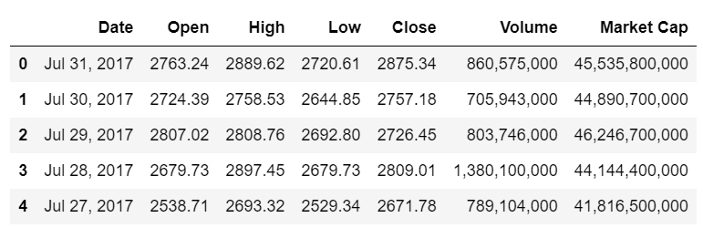
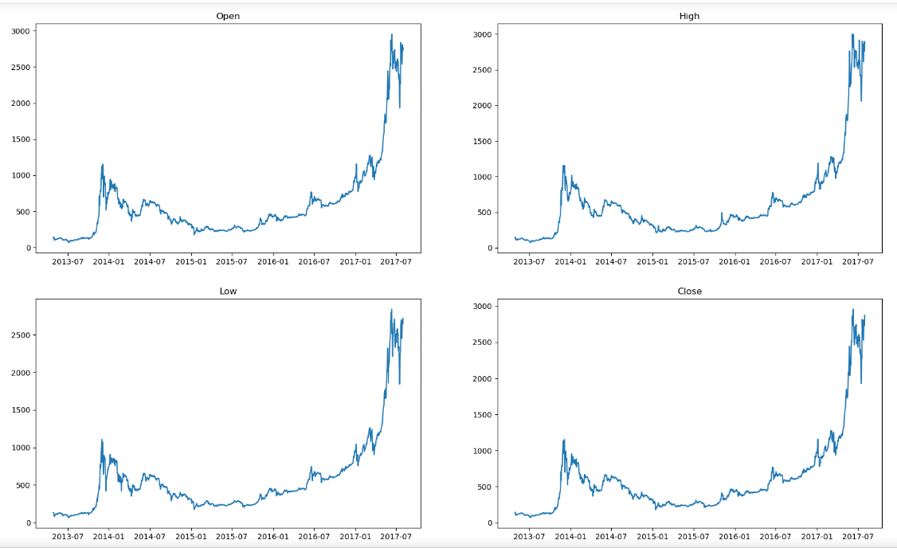
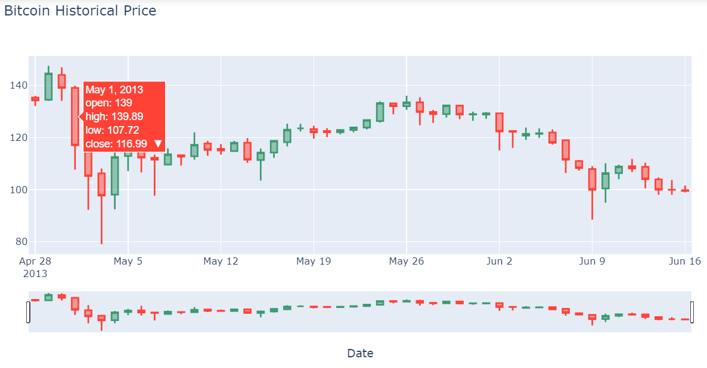
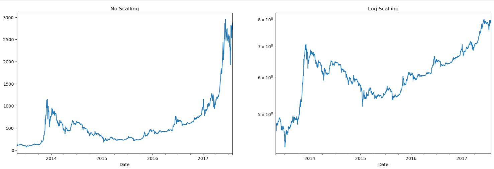
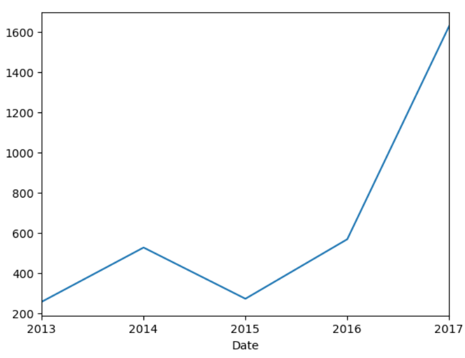
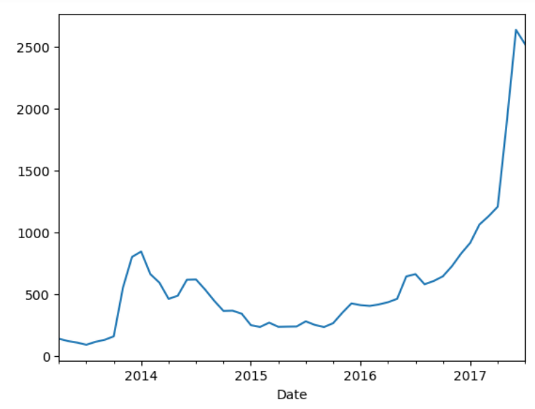
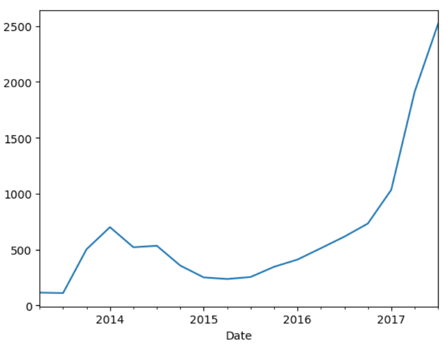
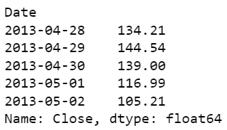
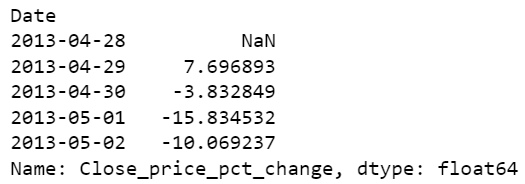
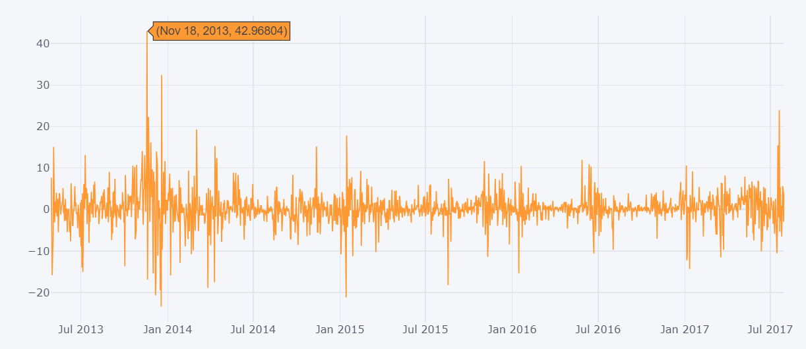

# Bitcoin Data Analysis

## Project Description

Data analyst got a project to analyze price of Bitcoin to get insight from this data. The challenges of these project include :

- Analyzing Change in Price of The Bitcoin Overtime
- Analyzing Bitcoin Price Using Candle-Stick Chart
- Analyzing Closing Price in depth
- Perform Analysis on Closing Price on Yearly, Quarterly, and Monthly Basis
- Analyzing Daily Change In Closing Price of Bitcoin

## Tools & Library Used

 &nbsp;
 &nbsp;

 &nbsp;
 &nbsp;
 &nbsp;
 &nbsp;
 &nbsp;

## Dataset Used

- [Bitcoin price](https://github.com/nickenshidqia/Bitcoin_Price_Data_Analysis/blob/0abd2fccff31e7cd4cf905a66663dc51b49ba436/bitcoin_price_Training%20-%20Training.csv)

## Project Result

[Click here to get on full code](https://github.com/nickenshidqia/Bitcoin_Price_Data_Analysis/blob/a50ddaefc4b120ccdd4eaaff939324ea1be109b4/Bitcoin%20Data%20Analysis.ipynb)

### Analyzing Change in Price of The Bitcoin Overtime

Create new dataset that includes Date, Open, High, Low, Close, Volume, Market Cap.

Then plot Open, High, Low, Close price into the line chart.

**Insight :**  
For each price for Open, High, Low, and Close, there are spike in 2014 and 2017.

### Analyzing Bitcoin Price Using Candle-Stick Chart

Create sample data from bitcoin dataset. Then create candle stick, where the x-axis is 'Date' and price data = 'High', 'Open', 'Close', 'Low'.

**Insight :**  
On 1 May 2013, we got the result that:

- open price : 139
- high price : 139.89
- low price : 107.72
- close price : 116.99

### Analyzing Closing Price in depth

Create the linear scale and log scale for close price

**Insight :**

- Logarithmic price scale are better than linear scale for showing less severe price increases or decreases.
- There is an upward trend in 2014 and 2017 for each graph.
- There is no seasonality in data.

### Perform Analysis on Closing Price on Yearly, Quarterly, and Monthly Basis

Create resample average close price on yearly, monthly, and quarterly :

Plot resample average close price on **yearly** :  

Plot resample average close price on **monthly** :  

Plot resample average close price on **quarterly** :  

### Analyzing Daily Change In Closing Price of Bitcoin

Access close daily price :  

Create daily change in percentage :  

Create interactive plot daily change :

**Insight :**

- On 18 November 2013 there is spike on closing price with the change 42.96%.
- On 19 December 2013 there is spike on closing price with the change 32.38%.
- On 20 July 2017 there is spike on closing price with the change 23.94%.
